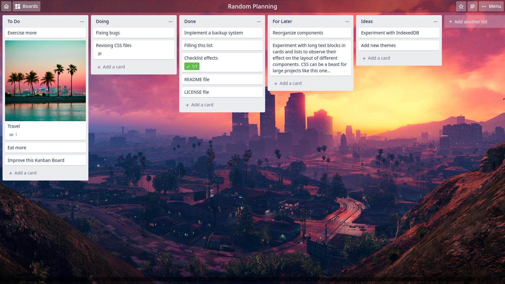

# Elixir

Elixir is a kanban board that runs locally.

It uses PostgreSQL as a database.



## Setup

First, create a database named `elixir`:
```pgsql
createdb elixir
```

Then, go in the `scripts` directory and run the following command:
```shell
psql -d elixir -a -f setup.pgsql
```

And that's all for the setup!

Now all that's left is to start serving Elixir. Go back to the root and run:
```shell
node app.js
```

You could also execute the previous line automatically on startup.

## Note

By default, Elixir uses the port `7001`, but you could change it in the `app.js` file.

## Disclaimer

This is far from complete but usable for now...

## Ideas
- Replace PostgreSQL with IndexedDB
